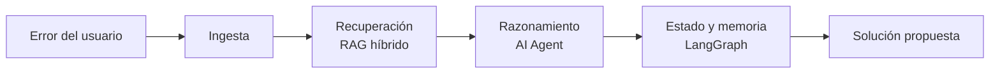

# 

## AI Agent para resolución de errores técnicos de LangChain, LangGraph, RAG, FAISS, Cohere y Streamlit

   
<br>
   

> AI Agent que recibe un error, razona sobre el, consultando documentación de LangChain, LangGraph, RAG, FAISS, Cohere, Streamlit y GitHub oficial. Detecta, diagnostica y resuelve errores técnicos, combinando búsqueda semántica y razonamiento agéntico. Recupera y devuelve una solución explicada, todo desde una interfaz web simple.

* Última verificación: 15 de julio de 2026.

##  Tabla de contenidos

<!-- no toc -->
* [Un problema real, universal y con un caso de uso clarísimo](#-un-problema-real-universal-y-con-un-caso-de-uso-clarísimo)
* [Lo que hace SophIA](#-lo-que-hace-sophia)
* [Arquitectura](#-arquitectura)
  * [Capa 1 → Python: toda la ingeniería](#capa-1--python-toda-la-ingeniería)
  * [Capa 2 → RAG: la capa de recuperación](#capa-2--rag-la-capa-de-recuperación)
  * [Capa 3 → LangGraph: la capa de memoria](#capa-3--langgraph-la-capa-de-memoria)
  * [Capa 4 → AI Agent: la capa de razonamiento](#capa-4--ai-agent-la-capa-de-razonamiento)
  * [Capa 5 → LangChain: la capa de orquestación](#capa-5--langchain-la-capa-de-orquestación)
  * [Pipeline](#pipeline)
* [Instalación](#-instalación)
* [Uso](#-uso)
  * [\* Ejemplo: consultar un error](#-ejemplo-consultar-un-error)
  * [\* Capturas](#-capturas)
* [Estructura del proyecto](#-estructura-del-proyecto)
* [Roadmap](#-roadmap)
  * [Core](#core)
  * [Documentación](#documentación)
  * [Futuro](#futuro)
* [Licencia](#-licencia)
* [Contribución](#-contribución)

##  Un problema real, universal y con un caso de uso clarísimo

Cuando trabajas con LangChain, LangGraph, RAG, FAISS, Cohere, Streamlit o cualquier framework del ecosistema, los errores son crípticos, la documentación está dispersa y en la web encuentras respuestas dispersas con soluciones que no siempre funcionan, incluso pueden confundir más. Varias pestañas abiertas, un video de YouTube aquí y otro allá. Acudes a una AI entrenada con información, algunas veces desactualizada. Pierdes horas en algo que debería tomar minutos.

##  Lo que hace SophIA

AI Agent al que le pegas un error, y él:

* **Entiende el contexto** → qué librería, qué versión, qué estás intentando hacer.
* **Busca en fuentes precisas** → documentación oficial, changelogs, issues de GitHub.
* **Razona sobre el error** → no solo recupera, sino que interpreta y conecta.
* **Propone una solución** → con explicación de por qué funciona.
* **Recuerda** → si ese error ya apareció antes en tu sesión, lo conecta.

##  Arquitectura

**SophIA** está construida en capas, cada una resolviendo un problema específico del flujo de debugging:

| Capa             | Tecnología  | Por qué                             |
| ---------------- | ----------- | ----------------------------------- |
| Ingesta          | Python      | Procesa docs, changelogs, issues    |
| Recuperación     | RAG         | Semántico + keywords                |
| Estado y memoria | LangGraph   | Recuerda contexto entre consultas   |
| Razonamiento     | AI Agent    | Decide cómo resolver, no solo busca |
| Orquestación     | LangChain   | Conecta todo el flujo               |

### Capa 1 → Python: toda la ingeniería

* Procesa documentación oficial.
* Extrae documentación de terceros.
* Normaliza documentación de Stack Overflow.
* Indexa changelogs.
* Recopila issues de GitHub.

### Capa 2 → RAG: la capa de recuperación

* Chunking estratégico con metadatos.
* Búsqueda híbrida: semántica + keywords.
* Reranking para precisión real.

> El índice vectorial se persiste en `faiss_index_sophia/` (generado automáticamente al correr `ingest.py`, no versionado).

### Capa 3 → LangGraph: la capa de memoria

* Mantiene memoria conversacional persistente.
* Recuerda contexto entre sesiones.

### Capa 4 → AI Agent: la capa de razonamiento

* Decide cuándo buscar información.
* Decide cuándo razonar sobre lo encontrado.
* Decide cuándo responder directamente.

### Capa 5 → LangChain: la capa de orquestación

* Conecta todo el flujo.
* Crea un plan de acciones.
* Ejecuta las acciones.

### Pipeline

Así se ve el flujo completo, de principio a fin:



##  Instalación

1. Clona el repositorio:

```bash
   git clone https://github.com/tu-usuario/sophia.git
   cd sophia
```

1. Crea y activa un entorno virtual:

```bash
   python -m venv venv
   venv\Scripts\activate
```

1. Instala las dependencias:

```bash
   pip install -r requirements.txt
```

1. Configura tus variables de entorno:

```bash
   cp .env.example .env
```

   > En Windows (CMD/PowerShell sin Git Bash), usa `copy .env.example .env` en su lugar.

   Luego edita `.env` con tus propias keys:

   | Variable              | Descripción                           |
   |-----------------------|---------------------------------------|
   | `ANTHROPIC_API_KEY`   | API key de Anthropic (Claude)         |
   | `COHERE_API_KEY`      | API key de Cohere                     |
   | `LANGSMITH_TRACING`   | Activa el tracing (`true`/`false`)    |
   | `LANGSMITH_ENDPOINT`  | Endpoint de LangSmith                 |
   | `LANGSMITH_API_KEY`   | API key de LangSmith                  |
   | `LANGSMITH_PROJECT`   | Nombre del proyecto en LangSmith      |

1. Ejecuta la aplicación:

```bash
   streamlit run app.py
```

##  Uso

Una vez levantada la app (`streamlit run app.py`), se abre en tu navegador en `http://localhost:8501`.

### * Ejemplo: consultar un error

<!-- TODO: reemplazar con un ejemplo real una vez completadas las pruebas -->

Le pegas el traceback directamente a Sophia:

```text
ModuleNotFoundError: No module named 'langchain.chains.retrieval_qa'
```

Y Sophia responde con el diagnóstico y la solución, citando la fuente: documentación oficial, changelog o issue donde encontró la respuesta).

### * Capturas

<!-- TODO: agregar captura de la interfaz una vez esté estable -->

##  Estructura del proyecto

```text
sophia/
├── .agents/
├── .claude/
├── .env.example
├── .gitignore
├── app.py                          # Interfaz Streamlit
├── ingest.py                       # Ingesta y procesamiento de fuentes
├── logger.py                       # Configuración de logging
├── rag_chain.py                    # Cadena RAG (recuperación + generación)
├── README.md
├── requirements-freeze.txt
└── urls.py                         # URLs de fuentes a indexar
```

##  Roadmap

### Core

* [ ] Capa de ingesta: procesamiento de docs, changelogs, issues
* [x] RAG híbrido con FAISS: semántico + keywords
* [x] Memoria conversacional con LangGraph
* [x] Razonamiento agéntico: decidir buscar/razonar/responder
* [x] Orquestación completa con LangChain
* [x] Interfaz en Streamlit

### Documentación

* [ ] Ejemplos reales de uso (pendiente de pruebas)
* [ ] Capturas de la interfaz
* [ ] Archivo `requirements.txt` (actualmente solo existe `requirements-freeze.txt`)

### Futuro

* [ ] Despliegue (Streamlit Cloud / Docker)
* [ ] Tests automatizados

##  Licencia

Este proyecto está bajo la licencia MIT — revisa el archivo [LICENSE](LICENSE) para más detalles.

##  Contribución

Este es un proyecto personal que nació de mi propio proceso de aprendizaje y especialización en RAG, LangChain, LangGraph, FAISS, Cohere y Streamlit. Dada las fricciones que se presentan durante la orquestación de la arquitectura de un AI Agentic. Si tienes sugerencias o encuentras un bug, siéntete libre de abrir un [issue](https://github.com/tu-usuario/sophia/issues).

¡Gracias por coincidir a la misma inquietud que me surgió a mí y contruibuir, haciendo que SophIA cumpla su propósito por el que fue creada con honestidad y confiabilidad técnica!

<p align="center">
  
</p>
