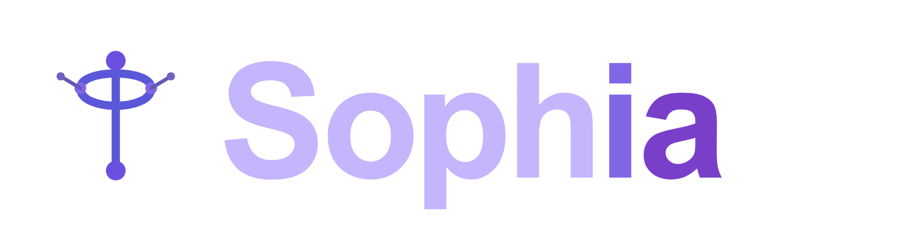
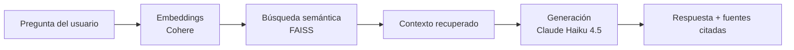
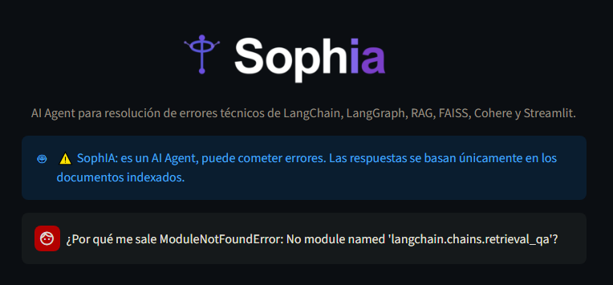
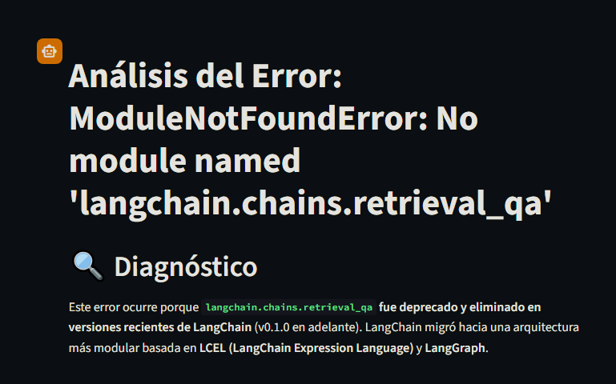
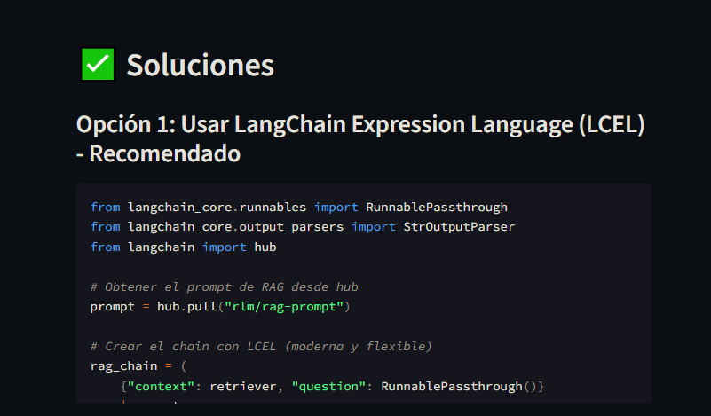
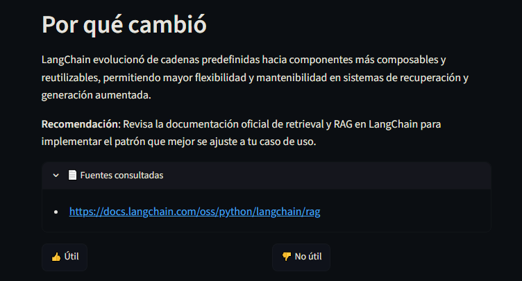
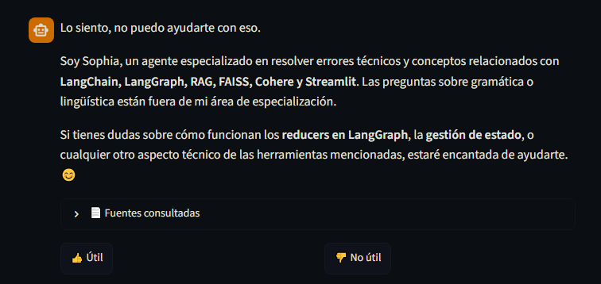
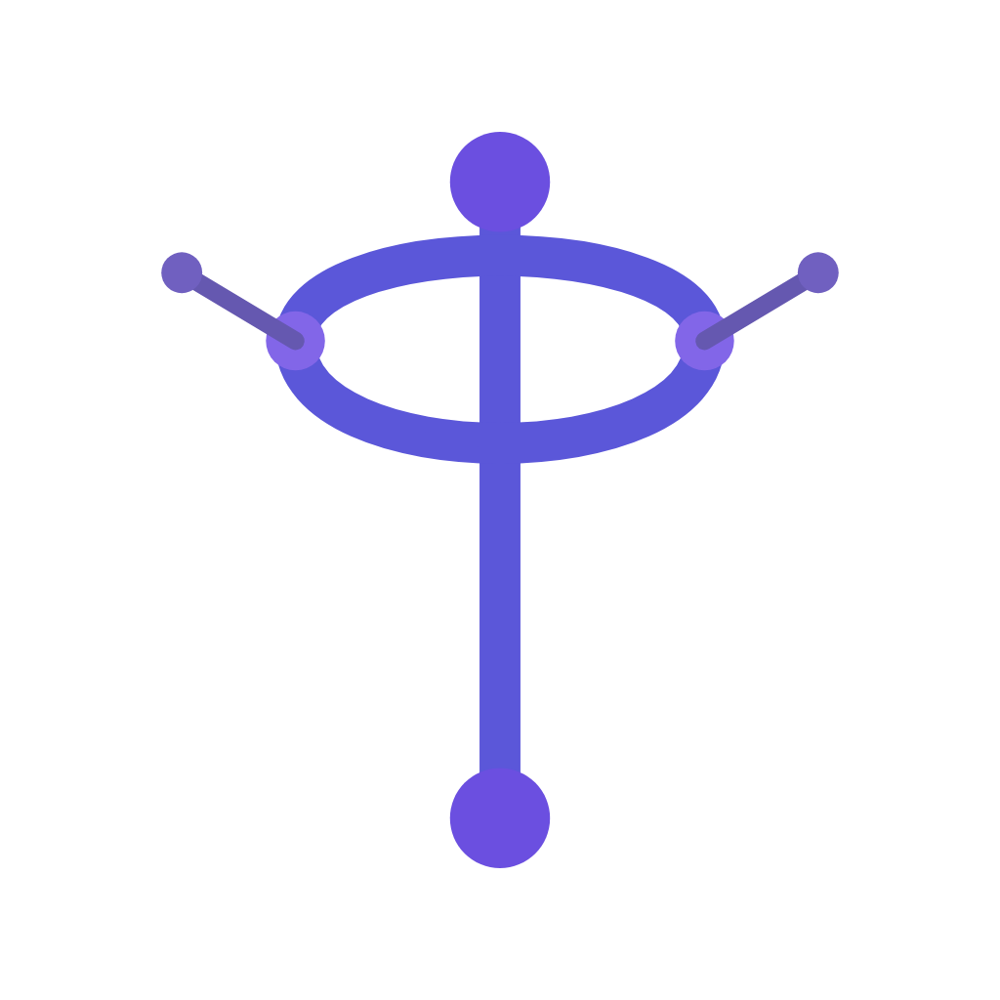

# 

## AI Agent para resolución de errores técnicos de LangChain, LangGraph, RAG, FAISS, Cohere y Streamlit

   
<br>
  

> AI Agent que recibe un error técnico de LangChain, LangGraph, RAG, FAISS, Cohere o Streamlit, busca contexto relevante en documentación oficial indexada mediante búsqueda semántica, y devuelve una solución explicada por Claude, todo desde una interfaz web simple.

* Última verificación: 18 de julio de 2026.

##  Tabla de contenidos

<!-- no toc -->
* [Un problema real, universal y con un caso de uso clarísimo](#-un-problema-real-universal-y-con-un-caso-de-uso-clarísimo)
* [Lo que hace SophIA](#-lo-que-hace-sophia)
* [Arquitectura](#-arquitectura)
  * [Pipeline](#pipeline)
* [Instalación](#-instalación)
* [Uso](#-uso)
  * [Ejemplo: consultar un error](#ejemplo-consultar-un-error)
  * [Captura](#captura)
* [Estructura del proyecto](#-estructura-del-proyecto)
* [Roadmap](#-roadmap)
  * [Core](#core)
  * [Documentación](#documentación)
  * [Futuro](#futuro)
* [Licencia](#-licencia)
* [Contribución](#-contribución)

##  Un problema real, universal y con un caso de uso clarísimo

Cuando trabajas con LangChain, LangGraph, RAG, FAISS, Cohere, Streamlit o cualquier framework del ecosistema, los errores son crípticos, la documentación está dispersa y en la web encuentras respuestas que no siempre funcionan, incluso pueden confundir más. Varias pestañas abiertas, un video de YouTube aquí y otro allá. Acudes a una AI entrenada con información, algunas veces desactualizada. Pierdes horas en algo que debería tomar minutos.

##  Lo que hace SophIA

Le pegas un error o le haces una pregunta técnica, y SophIA:

* **Busca en documentación oficial indexada** → LangChain, LangGraph y conceptos de RAG.
* **Recupera los fragmentos más relevantes** → mediante búsqueda semántica con FAISS.
* **Genera una respuesta explicada** → con Claude, citando las fuentes exactas que consultó.
* **Registra cada interacción** → pregunta, respuesta, fuentes y tiempo de respuesta, para trazabilidad.

##  Arquitectura

SophIA sigue un pipeline RAG clásico, con Claude como motor de generación:

| Capa | Tecnología | Qué hace |
| --- | --- | --- |
| Ingesta | Python + BeautifulSoup (`WebBaseLoader`) | Descarga y extrae texto de URLs de documentación oficial |
| Fragmentación | LangChain Text Splitters | Divide los documentos en fragmentos manejables |
| Embeddings | Cohere (`embed-multilingual-v3.0`) | Convierte fragmentos y preguntas en vectores |
| Recuperación | FAISS | Búsqueda semántica por similitud vectorial |
| Generación | **Claude (Haiku 4.5)** | Analiza el contexto recuperado, explica la causa del error y propone una solución, con guardarraíles de alcance temático |
| Orquestación | LangChain (LCEL) | Conecta retriever → prompt → LLM en una sola cadena |
| Trazabilidad | LangSmith | Registra cada ejecución para depuración y observabilidad |
| Interfaz | Streamlit | Chat web con historial de sesión, fuentes citadas y feedback |

### Pipeline



> **Nota sobre el término "AI Agent":** Sophia opera actualmente como una cadena RAG
> (recuperación → generación), no como un agente autónomo con toma de decisiones
> multi-paso. El roadmap contempla evolucionar hacia comportamiento agéntico real
> (ver sección [Futuro](#futuro)).

##  Instalación

1. Clona el repositorio:

```bash
git clone https://github.com/eandreaja/sophia.git
cd sophia
```

1. Crea y activa un entorno virtual:

```bash
python -m venv venv
venv\Scripts\activate
```

1. Instala las dependencias:

```bash
pip install -r requirements.txt
```

1. Configura tus variables de entorno:

```bash
cp .env.example .env
```

   > En Windows (CMD/PowerShell sin Git Bash), usa `copy .env.example .env` en su lugar.

   Luego edita `.env` con tus propias keys:

   | Variable              | Descripción                              |
   |-----------------------|------------------------------------------|
   | `ANTHROPIC_API_KEY`   | API key de Anthropic (Claude)            |
   | `COHERE_API_KEY`      | API key de Cohere                        |
   | `LANGSMITH_TRACING`   | Activa el tracing (`true`/`false`)       |
   | `LANGSMITH_ENDPOINT`  | Endpoint de LangSmith                    |
   | `LANGSMITH_API_KEY`   | API key de LangSmith                     |
   | `LANGSMITH_PROJECT`   | Nombre del proyecto en LangSmith         |
   | `USER_AGENT`          | Identificador parapeticiones de scraping |

1. Construye el índice de documentos (solo la primera vez, o al actualizar `urls.py`):

```bash
python ingest.py
```

1. Ejecuta la aplicación:

```bash
streamlit run app.py
```

##  Uso

Una vez levantada la app (`streamlit run app.py`), se abre en tu navegador en `http://localhost:8501`.

### Ejemplo: consultar un error

Le escribes tu pregunta o el error directamente a SophIA:

```text
¿Por qué me sale ModuleNotFoundError: No module named 'langchain.chains.retrieval_qa'?
```



Y SophIA responde con el diagnóstico:



Te brinda las opciones encontradas para tu error:



Citando la documentación oficial donde encontró la respuesta:



Incluso ante preguntas fuera de su alcance, Sophia reconoce sus límites en vez de inventar una respuesta:



### Captura

Video del flujo completo. desde la pregunta hasta la respuesta con fuentes citadas:

https://github.com/user-attachments/assets/4033a672-9d5d-45a0-91a2-dec11e710ced

##  Estructura del proyecto

```text
sophia/
├── assets/
│   ├── diagnostico.png             # Diagnóstico
│   ├── emoji.png                   # Emoji
│   ├── fuentes.png                 # Fuentes citadas
│   ├── limites.png                 # Límites
│   ├── opciones.png                # Opciones
│   ├── pregunta.png                # Pregunta
│   ├── sophia-lockup.png           # Logo + nombre
│   └── sophia.png                  # Ícono
├── faiss_index_sophia/             # Índice vectorial pre-construido (para deploy)
│   ├── index.faiss                 # Vectores de embeddings
│   └── index.pkl                   # Metadatos y mapeo de documentos
├── .env.example                    # Plantilla de variables de entorno
├── .gitignore
├── app.py                          # Interfaz Streamlit
├── ingest.py                       # Ingesta: URLs → embeddings → índice FAISS
├── logger.py                       # Registro de interacciones (.jsonl)
├── rag_chain.py                    # Cadena RAG (recuperación + generación)
├── urls.py                         # URLs de documentación a indexar
├── requirements.txt                # Dependencias del proyecto
├── requirements-freeze.txt         # Versiones exactas resueltas (referencia)
├── LICENSE
└── README.md
```

> No versionados (generados localmente o excluidos por seguridad, ver `.gitignore`): `logs/` (registro de interacciones), `.env` (keys reales).

##  Roadmap

### Core

* [x] Ingesta de documentación oficial vía scraping de URLs
* [x] Fragmentación y embeddings con Cohere
* [x] Recuperación semántica con FAISS
* [x] Generación de respuestas con Claude
* [x] Orquestación con LangChain (LCEL)
* [x] Interfaz en Streamlit con historial, fuentes citadas y feedback
* [x] Trazabilidad con LangSmith y logging local

### Documentación

* [x] Ejemplo real de uso (pregunta/respuesta)
* [x] Capturas de la interfaz

### Futuro

* [ ] Versión en inglés del README (`README.en.md`), dado que gran parte de la comunidad de LangChain/LangGraph se documenta en ese idioma
* [ ] Búsqueda híbrida (semántica + keywords) y reranking
* [ ] Memoria conversacional persistente entre sesiones (LangGraph)
* [ ] Razonamiento agéntico: decidir cuándo buscar vs. responder directamente
* [ ] Ingesta de fuentes adicionales: issues de GitHub, Stack Overflow, changelogs
* [ ] Reconstrucción automática del índice en despliegues efímeros
* [ ] Despliegue en Streamlit Community Cloud
* [ ] Tests automatizados

##  Licencia

Este proyecto está bajo la licencia MIT — revisa el archivo [LICENSE](LICENSE) para más detalles.

##  Contribución

Este es un proyecto personal que nació de mi propio proceso de aprendizaje y especialización en RAG, LangChain, LangGraph, FAISS, Cohere y Streamlit, ante las fricciones reales que se presentan al orquestar la arquitectura de un AI Agent. Si tienes sugerencias o encuentras un bug, siéntete libre de abrir un [issue](https://github.com/eandreaja/sophia/issues).

¡Gracias por compartir la misma inquietud que me impulsó a mí, y por contribuir a que SophIA cumpla el propósito por el que fue creada, con honestidad y confiabilidad técnica!

<p align="center">
  
</p>
